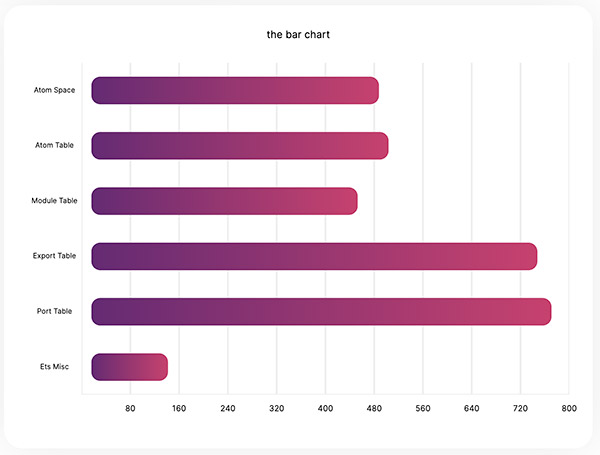
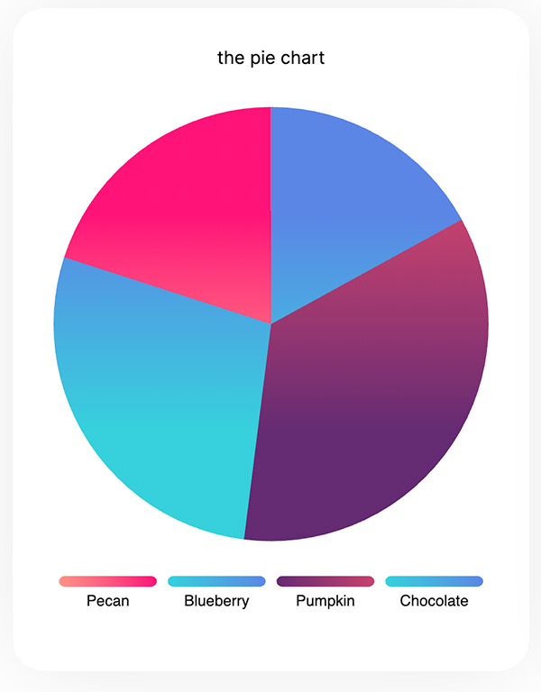
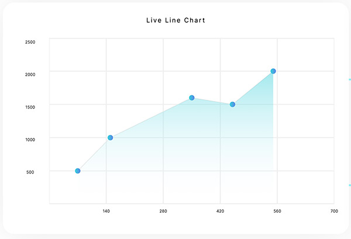
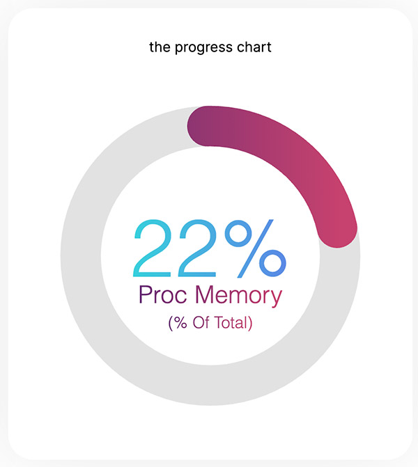
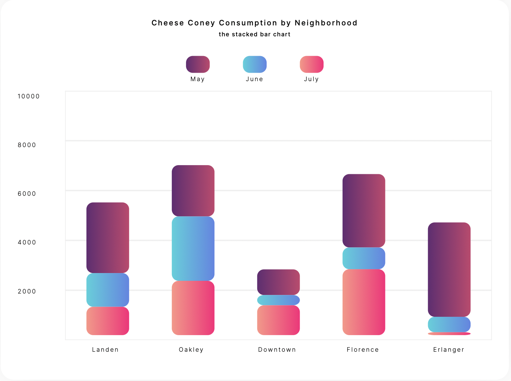
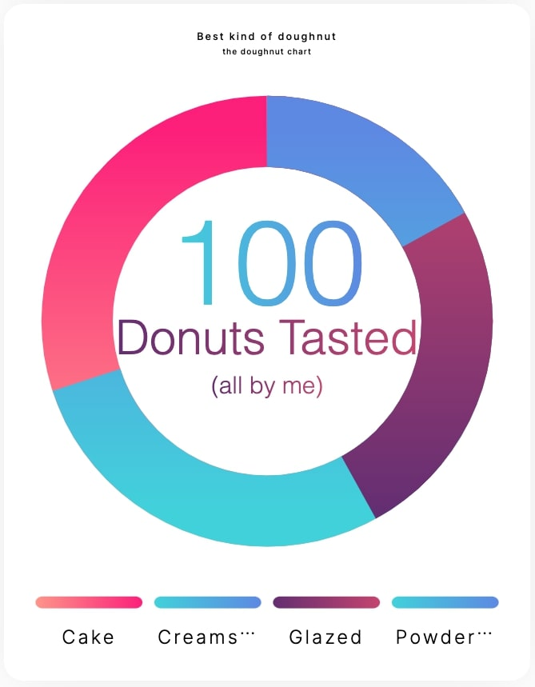

# Uncharted Phoenix
A simple ***Elixir*** charting library that generates easy to customize charts for ***Phoenix*** and ***LiveView***.

## Features
- Easily generate pie charts, doughnut charts, column charts, bar charts, progress counters, and line charts
- Generates responsive and accessible SVGs as LiveView components
- Provides advanced styling like gradients and rounded corners
- Smooth animations for updating live data to the UI

### Accessibility
We've worked hard to ensure Uncharted Phoenix is both screen reader and keyboard accessible. Learn more about our approach here: [Accessibility Documentation](/docs/Accessibility.md)

[API Documentation](https://hexdocs.pm/uncharted_phoenix/)

## HEX Installation
Add this to your mix.exs deps:
``` {:uncharted_phoenix, "~> 0.2.0"} ```

## How To Use

### Rendering Charts

To render any of the built-in UnchartedPhoenix chart components, pass an `Uncharted.chart` to the `render/2` function:  

```elixir
my_chart = %Uncharted.BaseChart{...}

# Inside of a LiveView or LiveComponent .leex template:

<%= UnchartedPhoenix.render(@socket, @my_chart) %>
```

By defining an implementation of the `Uncharted.Component` protocol for all of Uncharted's built-in chart types, `UnchartedPhoenix.render/2` knows how to render the appropriate kind of chart based on the dataset of the `Uncharted.BaseChart` struct you pass in. For example, if you pass a chart with a `%Uncharted.BarChart.Dataset{}` to `UnchartedPhoenix.render/2`, UnchartedPhoenix will render the `UnchartedPhoenix.LiveBarComponent` for you and handle other setup the component needs to attach event handlers, such as giving the component an ID. 

If you wish to render more than one of the same type of chart in the same view, you can override the default ID by defining a value for the `%Uncharted.BaseChart{}` struct's `:component_id` field. 

By default, if you do not set the `:component_id` field on the `BaseChart`, UnchartedPhoenix will give the LiveComponent it renders an id equal to the stringified version of the dataset module defined on the BaseChart, i.e. if you pass a `BaseChart` with an `Uncharted.BarChart.Dataset` to `UnchartedPhoenix.render/2`, the id of the LiveBarComponent that gets rendered will be `"Uncharted.BarChart.Dataset"`. If you define a `component_id` on your `BaseChart` struct, the component_id will be appended to the default id like this: `"Uncharted.BarChart.Dataset__#{my_custom_component_id}"`.

### The Column Chart


```elixir
column_chart = %BaseChart{
  title: "Cheese Coney Consumption by Neighborhood",
  colors: colors,
  width: 700,
  height: 400,
  dataset: %ColumnChart.Dataset{
    axes: %BaseAxes{
      magnitude_axis: %MagnitudeAxis{
        max: 10_000,
        min: 0
      }
    },
    data: Cincy.get()
  }
}
```

### The Bar Chart

```elixir
defp bar_chart do
  memory_data = MemoryChart.get()

  data = MemoryChart.convert_to_datum(memory_data)

  %BaseChart{
    title: "Live Beam Memory Stats",
    width: 600,
    height: 400,
    colors: %{
      blue: "#36D1DC",
      rosy_gradient: %Gradient{
        start_color: "#642B73",
        stop_color: "#C6426E"
      }
    },
    dataset: %BarChart.Dataset{
      axes: %BaseAxes{
        magnitude_axis: %MagnitudeAxis{
          max: MemoryChart.chart_max(memory_data),
          min: 0
        }
      },
      data: data
    }
  }
end
```

### The Pie Chart


```elixir
pie_chart = %BaseChart{
  title: "Best kind of pie",
  colors: %{
    rose_gradient: %Gradient{
      start_color: "#642B73",
      stop_color: "#C6426E"
    },
    blue_gradient: %Gradient{
      start_color: "#36D1DC",
      stop_color: "#5B86E5"
    },
    red_gradient: %Gradient{
      start_color: "#FF9486",
      stop_color: "#FF1379"
    }
  },
  dataset: %PieChart.Dataset{
    data: [
      %BaseDatum{
        name: "Pecan",
        fill_color: :red_gradient,
        values: [20.0]
      },
      %BaseDatum{
        name: "Blueberry",
        fill_color: :blue_gradient,
        values: [28.0]
      },
      %BaseDatum{
        name: "Pumpkin",
        fill_color: :rose_gradient,
        values: [35.0]
      },
      %BaseDatum{
        name: "Chocolate",
        fill_color: :blue_gradient,
        values: [17.0]
      }
    ]
  }
}
```

### The Line Chart


```elixir
line_chart = %BaseChart{
  title: "Live Line Chart",
  colors: colors,
  width: 700,
  height: 400,
  dataset: %ColumnChart.Dataset{
    axes: %XYAxes{
      x: %MagnitudeAxis{
        max: 700,
        min: 0
      },
      y: %MagnitudeAxis{
        max: 2500,
        min: 0
      }
    },
    data: [
      %BaseDatum{
        name: "Point 1",
        fill_color: :blue_gradient,
        values: [70, 500]
      },
      %BaseDatum{
        name: "Point 2",
        fill_color: :blue_gradient,
        values: [150, 1000]
      },
      %BaseDatum{
        name: "Point 3",
        fill_color: :blue_gradient,
        values: [350, 1600]
      },
      %BaseDatum{
        name: "Point 4",
        fill_color: :blue_gradient,
        values: [450, 1500]
      },
      %BaseDatum{
        name: "Point 5",
        fill_color: :blue_gradient,
        values: [550, 2000]
      }
    ]
  }
}
```

### The Progress Chart

```elixir
defp progress_chart(from: %BaseChart{} = chart) do
  memory = Memory.get()

  %BaseChart{
    chart
    | title: "Process Memory / Total",
      colors: %{
        rose_gradient: %Gradient{
          start_color: "#642B73",
          stop_color: "#C6426E"
        },
        blue_gradient: %Gradient{
          start_color: "#36D1DC",
          stop_color: "#5B86E5"
        },
        red_gradient: %Gradient{
          start_color: "#FF9486",
          stop_color: "#FF1379"
        },
        gray: "#e2e2e2"
      },
      dataset: %ProgressChart.Dataset{
        background_stroke_color: :gray,
        label: "Proc Memory",
        secondary_label: "(% Of Total)",
        to_value: memory.total,
        current_value: memory.process,
        percentage_text_fill_color: :blue_gradient,
        percentage_fill_color: :rose_gradient,
        label_fill_color: :rose_gradient,
        doughnut_width: 5,
        progress_shape: :round
      }
  }
end
```
### The Scatter Plot

There are 3 potential data values per point. The first two are required. They represent X and Y values. The third is optional and represents the radius of that point. Points default to a radius of `6`.

```elixir
scatter_plot = %BaseChart{
  title: "Live Scatter Plot",
   axes: %XYAxes{
      x: %MagnitudeAxis{
        max: 700,
        min: 0
      },
      y: %MagnitudeAxis{
        max: 2500,
        min: 0
      }
    },
    data: [
      %BaseDatum{
        name: "Point 1",
        fill_color: :blue_gradient,
        values: [70, 500, 6]
      },
      %BaseDatum{
        name: "Point 2",
        fill_color: :blue_gradient,
        values: [150, 1000, 8]
      },
      %BaseDatum{
        name: "Point 3",
        fill_color: :blue_gradient,
        values: [350, 1600]
      },
      %BaseDatum{
        name: "Point 4",
        fill_color: :blue_gradient,
        values: [450, 1500]
      },
      %BaseDatum{
        name: "Point 5",
        fill_color: :blue_gradient,
        values: [550, 2000]
      }
    ]
  }
```

### The Column Chart


```elixir
column_chart = %BaseChart{
  title: "Cheese Coney Consumption by Neighborhood",
  colors: colors,
  width: 700,
  height: 400,
  dataset: %ColumnChart.Dataset{
    axes: %BaseAxes{
      magnitude_axis: %MagnitudeAxis{
        max: 10_000,
        min: 0
      }
    },
    data: Cincy.get()
  }
}
```

### Adding Stacked Sections to the Column or Bar Chart

You can add sections to a column or bar chart by adding a sections array to the dataset.

```elixir
column_chart = %BaseChart{
  title: "Cheese Coney Consumption by Neighborhood",
  colors: colors,
  dataset: %ColumnChart.Dataset{
    axes: %BaseAxes{
      magnitude_axis: %MagnitudeAxis{
        max: 10_000,
        min: 0
      }
    },
    sections: [
      %Section{fill_color: :blue_gradient, label: "June", index: 1},
      %Section{fill_color: :red_gradient, label: "July", index: 2},
      %Section{fill_color: :rose_gradient, label: "May", index: 0}
    ],
    data: ~w(Landen Oakley Downtown Florence Erlanger)
    |> Enum.map(fn neighborhood ->
      %BaseDatum{
        name: neighborhood,
        values: [:rand.uniform() * 4_000, :rand.uniform() * 3_000, :rand.uniform() * 3_000]
      }
    end)
  }
}
```

### The Doughnut Chart


```elixir
doughnut_chart = %BaseChart{
  title: "Best kind of doughnut",
  colors: %{
    rose_gradient: %Gradient{
      start_color: "#642B73",
      stop_color: "#C6426E"
    },
    blue_gradient: %Gradient{
      start_color: "#36D1DC",
      stop_color: "#5B86E5"
    },
    red_gradient: %Gradient{
      start_color: "#FF9486",
      stop_color: "#FF1379"
    }
  },
  dataset: %DoughnutChart.Dataset{
    data: [
      %BaseDatum{
        name: "Cake",
        fill_color: :red_gradient,
        values: [30.0]
      },
      %BaseDatum{
        name: "Creamstick",
        fill_color: :blue_gradient,
        values: [28.0]
      },
      %BaseDatum{
        name: "Glazed",
        fill_color: :rose_gradient,
        values: [25.0]
      },
      %BaseDatum{
        name: "Powdered",
        fill_color: :blue_gradient,
        values: [17.0]
      }
    ],
    center_value: 100,
    center_value_fill_color: :blue_gradient,
    label: "Donuts Tasted",
    label_fill_color: :rose_gradient,
    secondary_label: "(all by me)",
  }
}
```

### Base Chart Colors
Base chart configuration allows you to define set solid colors and gradients for any chart you will use within the application.

#### Set a Base Color

```elixir
colors = %{
  blue: "#6bdee4"
}
```

#### Set a Base Gradient Color
```elixir
colors = %{
  rose_gradient: %Gradient{
    start_color: "#642B73",
    stop_color: "#C6426E"
  }
}
```

### Configure Grid Line Display
You can configure the color and width of grid lines, as well as whether or not to display them. Set `line_color` to a string or the atom key of a set base color or gradient (see above). Set `line_width` to an integer to change the width of grid lines. Set `display_lines` to `false` to hide grid lines along that axis. Set `show_gridlines` on `XYAxes` or `BaseAxes` to `false` to hide all grid lines.
```elixir
%MagnitudeAxis{
  line_color: "#efefef"
  line_width: 2,
  display_lines: true
}
```
